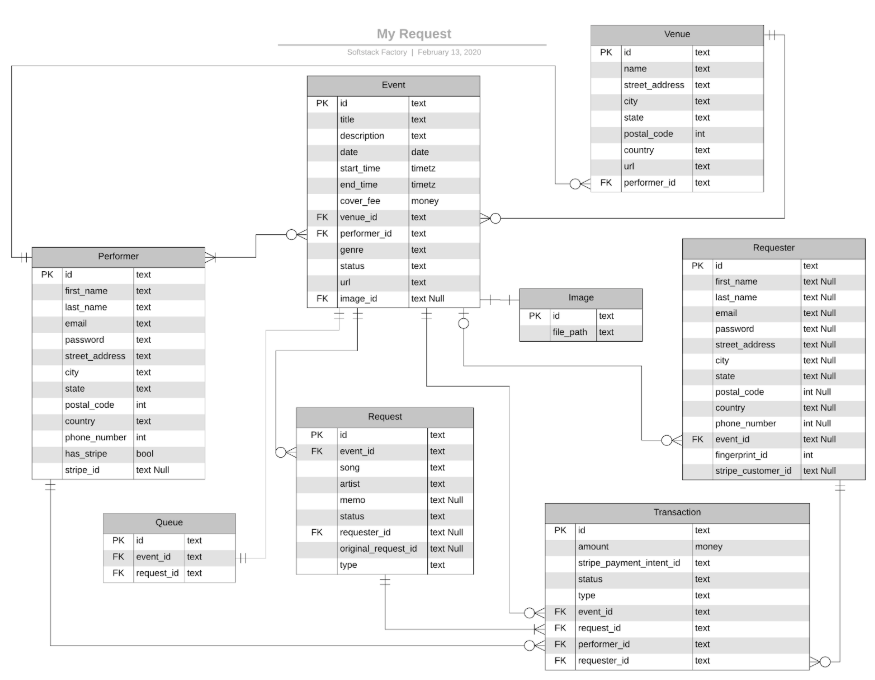

# AWS Serverless API & Database

Open the Serverless Framework dashboard to gain instant awareness of your service’s health - from errors, cold starts and timeouts, to invocations and request patterns. 
Glance at the latest alerts or dive in deeper into function spans, stack traces and logs.

[Serverless Framework Dashboard](https://dashboard.serverless.com/tenants/softstack/applications/my-request/services/my-request-events-api/stage/dev/region/us-west-2)

Documentation:
- [Events API](services/events/README.md)
- [Images API](services/images/README.md)
- [Queue API](services/queue/README.md)
- [Request API](services/request/README.md)
- [Transaction API](services/transaction/README.md)
- [Requester API](services/requester/README.md)
- [Venues API](services/venues/README.md)

