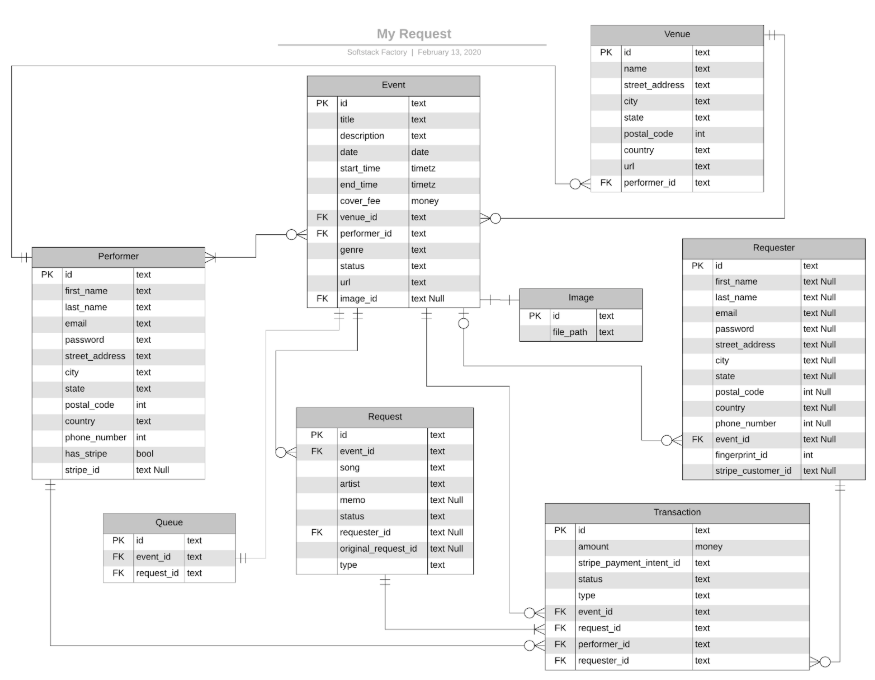

# AWS Serverless API & Database

Endpoints are created using the [Serverless Framework](https://serverless.com/) YAML + CLI Development to deploy to AWS.
The Serverless Framework uses a config file called `serverless.yml` which is used to deploy all your services to AWS.

Current Endpoints:
- Events:  https://qcvyxnimu4.execute-api.us-west-2.amazonaws.com/dev/events
- Images:  https://90bx9hlja5.execute-api.us-west-2.amazonaws.com/dev/images
- Queue:  https://90bx9hlja5.execute-api.us-west-2.amazonaws.com/dev/queue
- Requests:   https://y05btwgzvf.execute-api.us-west-2.amazonaws.com/dev/requests
- Requester:   https://npfjwp3yrd.execute-api.us-west-2.amazonaws.com/dev/requester
- Transactions:   https://hndjafk1sl.execute-api.us-west-2.amazonaws.com/dev/transactions
- Venues:   https://4gw3k61sti.execute-api.us-west-2.amazonaws.com/dev/venues

# Endpoint Deployment Guide

The following steps will guide you through creating a new endpoint with all the supporting AWS services.
A template folder has been pre-configured to deploy an API service to AWS.

#### Prerequisites:
Before moving forward, you must be registered with the Serverless Framework & AWS. If you don't have either of the 
two, register for the service before continuing. The AWS requirement is specific to this project as Serverless can
be deployed on multiple platforms.
- [Serverless Setup](https://serverless.com/framework/docs/getting-started/)
- [AWS SignUp](https://portal.aws.amazon.com/billing/signup?nc2=h_ct&src=header_signup&redirect_url=https%3A%2F%2Faws.amazon.com%2Fregistration-confirmation#/start)
- [Serverless Framework AWS Configuration](https://serverless.com/framework/docs/providers/aws/guide/credentials#setup-with-serverless-config-credentials-command) 

#### The steps to create additional endpoints to follow:

1. Copy the `template` folder and rename to desired endpoint name, for this example we'll name
the endpoint `requests`

                            SERVICES DIRECTORY
        
        ===== Before =====                          ===== After =====
        
        services                                    services
        ├── events                                  ├── events
        ├── images                                  ├── images
        └── venues                                  └── venues
        └── template                                └── template
            ├── README.md                           └── requests
            ├── serverless.yml                          ├── README.md
            └── src                                     ├── serverless.yml
                ├── app.js                              └── src
                ├── event.json                              ├── app.js
                └── index.js                                ├── event.json
                                                            └── index.js

2. Edit line 1 in the `serverless.yml` file. Change the value of service which is currently set to `<ENDPOINT_NAME>` to
your selected name, in our example we will rename it to `requests`

                                serverless.yml
        
        ===== Before =====                          ===== Afrer =====
        
        service: <ENDPOINT_NAME>                    service: requests
        app: my-request                             app: my-request
        org: softstack                              org: softstack
 
3. Open the `src/app.js` file and replace all words `template` with the name of your endpoint, in our example we'll
be renaming everything to `requests`.

4. From the terminal navigate to the newly created directory and run:

        serverless deploy
        
If successful you should get the deployed service information including the endpoint, if not, ask DW for assistance.

##### AWS Resources Deployed: 
   - API Gateway
   - DynamoDB
   - Lambda
   - S3
   - CloudWatch
   - CloudFormation

# Serverless Framework Dashboard

Open the Serverless Framework dashboard to gain instant awareness of your service’s health - from errors, cold starts
and timeouts, to invocations and request patterns. Glance at the latest alerts or dive in deeper into function spans, 
stack traces and logs.

[Serverless Framework Dashboard](https://dashboard.serverless.com/tenants/softstack/applications/my-request/services/my-request-events-api/stage/dev/region/us-west-2)

# Documentation

- [Events API](services/events/README.md)
- [Images API](services/images/README.md)
- [Queue API](services/queue/README.md)
- [Request API](services/requests/README.md)
- [Transactions API](services/transactions/README.md)
- [Requester API](services/requester/README.md)
- [Venues API](services/venues/README.md)
- [Serverless Framework Documentation](https://serverless.com/framework/docs/providers/aws/)
- [Sample Data Models](https://github.com/SoftStackFactory/my-request/tree/develop/src/assets/requests)

# Data Models

